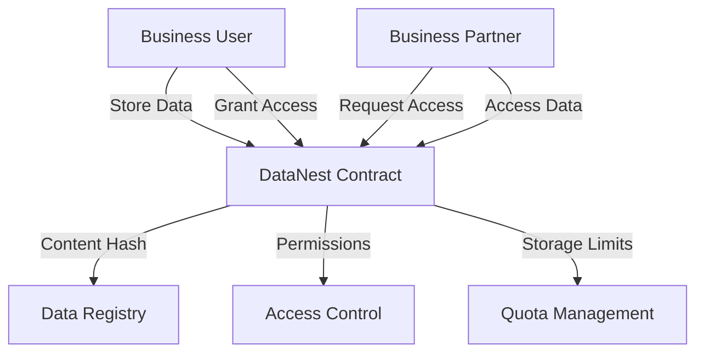

# DataNest Decentralized Storage

A secure, decentralized storage solution built on Stacks blockchain, designed specifically for small businesses seeking an alternative to centralized cloud storage services.

## Overview

DataNest enables businesses to:
- Store and manage critical business data on decentralized infrastructure
- Verify data integrity through content addressing
- Control granular access permissions for data sharing
- Maintain complete ownership of their information
- Benefit from transparent, predictable pricing

The platform prioritizes security, privacy, and ease of use while leveraging blockchain technology to provide immutable proof of data integrity and ownership.

## Architecture

DataNest uses a hybrid storage approach:
- Actual data is stored off-chain for scalability
- Metadata, permissions, and ownership are managed on-chain
- Content addressing (SHA-256 hashing) ensures data integrity
- Smart contract manages access control and storage quotas



## Contract Documentation

### datanest-storage.clar

The core contract managing all storage operations and access control.

**Key Features:**
- Data registration and ownership tracking
- Granular permission management
- Storage quota system
- Content integrity verification
- Usage-based pricing model

**Access Levels:**
- `read`: Basic data access
- `write`: Data modification rights
- `admin`: Full control over data

## Getting Started

### Prerequisites
- Clarinet for local development
- Stacks wallet for mainnet interaction

### Basic Usage

1. Purchase storage quota:
```clarity
(contract-call? .datanest-storage purchase-storage-quota u10)
```

2. Store data:
```clarity
(contract-call? .datanest-storage store-data 
    0x4f21c47d2b8695bf03e2b3896428335ef680c832a20384717e959d7bb0529891
    u1000
    "financial-report-2023"
    "Annual financial report"
    "document"
)
```

3. Grant access:
```clarity
(contract-call? .datanest-storage grant-access
    0x4f21c47d2b8695bf03e2b3896428335ef680c832a20384717e959d7bb0529891
    'ST1PQHQKV0RJXZFY1DGX8MNSNYVE3VGZJSRTPGZGM
    "read"
)
```

## Function Reference

### Storage Management

```clarity
(store-data (content-hash (buff 32)) (size-bytes uint) (name (string-ascii 100)) (description (string-ascii 250)) (data-type (string-ascii 50)))
```
Registers new data in the system.

```clarity
(delete-data (content-hash (buff 32)))
```
Marks data as inactive and releases storage quota.

```clarity
(update-data-metadata (content-hash (buff 32)) (name (string-ascii 100)) (description (string-ascii 250)) (data-type (string-ascii 50)))
```
Updates metadata for existing data.

### Access Control

```clarity
(grant-access (content-hash (buff 32)) (accessor principal) (access-level (string-ascii 20)))
```
Grants access permissions to another user.

```clarity
(revoke-access (content-hash (buff 32)) (accessor principal))
```
Revokes previously granted access.

### Quota Management

```clarity
(purchase-storage-quota (stx-amount uint))
```
Purchases additional storage quota (10000 bytes per STX).

```clarity
(get-storage-quota (user principal))
```
Retrieves current storage quota and usage.

## Development

### Local Testing

1. Initialize Clarinet project:
```bash
clarinet new datanest-project
```

2. Run tests:
```bash
clarinet test
```

### Deployment Considerations

- Deploy contract first
- Initialize platform fee percentage
- Monitor storage quota usage
- Set up off-chain indexer for efficient data listing

## Security Considerations

### Limitations
- Content hashes must be unique
- Maximum file name length: 100 characters
- Maximum description length: 250 characters
- Platform fee capped at 20%

### Best Practices
- Verify content hashes before submission
- Regularly audit access permissions
- Monitor storage quota usage
- Keep access credentials secure
- Implement appropriate data backup strategies

### Access Control
- Only data owners can grant permissions
- Permission levels are hierarchical
- Admin access should be granted cautiously
- Regular audit of granted permissions recommended